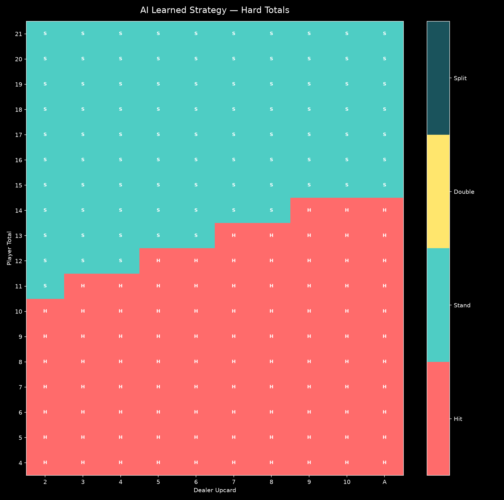
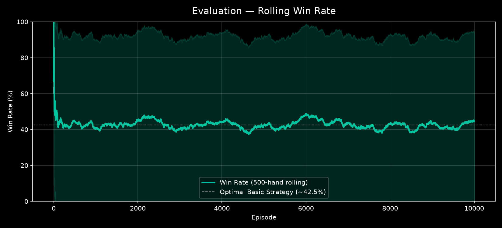

<!-- markdownlint-disable MD033 MD041 -->
<div align="center">

# BJ - AI

**A Deep Reinforcement Learning Agent that learns the perfect Blackjack strategy.**


<br/>


</div>

---

## About The Project

**Blackjack AI** is a complete ecosystem for training, evaluating, and visualizing a Reinforcement Learning agent playing Blackjack.

Instead of relying on hardcoded heuristics, the agent learns the mathematically optimal "Basic Strategy" strictly through trial, error, and financial reward using the **Maskable PPO** algorithm.

The project features a pure Python engine with no external dependencies simulating true casino rules, a Gymnasium wrapper for AI integration, and a beautiful **Textual-based Terminal User Interface (TUI)** to manage training runs and observe metrics in real-time.

---

## Key Features

| Feature | Description |
| :--- | :--- |
| **Pure Python Engine** | Accurate casino rules (S17, 3:2 payout, splits, doubles) completely decoupled from AI logic. |
| **Maskable PPO** | Prevents the AI from exploring impossible actions (e.g., splitting without a pair), vastly accelerating convergence. |
| **Dynamic Artifacts** | Automatically generates beautiful heatmaps, win-rate charts, and markdown reports for every single training run. |
| **Powerful CLI** | Override any hyperparameter on the fly using dot-notation (e.g., `--set env.num_decks=1`). |
| **TUI Dashboard** | Watch your AI learn live in your terminal with a gorgeous Textual interface. |

<p align="center">
  
</p>

---

## Architecture

The codebase strictly follows the **Single Responsibility Principle (SRP)**:

```text
blackjack-ai/
├── engine/        # The Casino: Card, Deck, Hand, Game logic. Pure Python.
├── train/         # The Brain: Gymnasium environment & PPO training script.
├── eval/          # The Examiner: Runs evaluations & generates strategy heatmaps.
├── tui/           # The Dashboard: Real-time Textual UI.
├── utils/         # The Tools: Dynamic config loading, Matplotlib charts, Reporting.
└── config.json    # The Blueprint: Centralized hyperparameter definitions.
```

---

## Getting Started

### Prerequisites

This project uses [uv](https://github.com/astral-sh/uv) as an incredibly fast Python package manager.

```bash
# Install uv (if you haven't already)
curl -LsSf https://astral.sh/uv/install.sh | sh
```

### Installation

Clone the repo and install dependencies:

```bash
git clone https://github.com/Nexlein/blackjack-ai.git
cd blackjack-ai

# uv will automatically create a virtual environment and install dependencies
uv sync
```

---

## Usage

### 1. The Interactive Dashboard (TUI)

The easiest way to manage the AI is through the gorgeous terminal interface.

```bash
uv run python -m tui.main
```

<div align="center">
  <b>Demo TUI :</b>
</div>


<div align="center">
  <ul style="text-align:left; margin:0; padding-left:20px; display:inline-block;">
    <li>Press <kbd>t</kbd> to start a new Training run.</li>
    <li>Press <kbd>e</kbd> to evaluate the latest model.</li>
    <li>Press <kbd>q</kbd> to quit.</li>
  </ul>
</div>

### 2. Command Line (CLI)

The CLI is fully dynamic. You can override any configuration value using the `--set` flag and dot notation.

**Train a model:**

```bash
# Standard run (uses config.json)
uv run python -m train.main

# Train a model on a single-deck shoe, with a custom batch size
uv run python -m train.main --set env.num_decks=1 train.batch_size=128
```

**Evaluate a model:**

```bash
# Evaluate a specific artifact for 50,000 episodes
uv run python -m eval.main 2026-07-21_18-00-00 --episodes 50000

# See how an AI trained on 6 decks handles a 1-deck game
uv run python -m eval.main 2026-07-21_18-00-00 --set env.num_decks=1
```

---

## Developer Guide (Pimping the AI)

Interested in making the AI smarter? Here is how to extend the project:

1. **Card Counting:**

   Currently, the AI doesn't count cards. To implement this, modify `train/features.py` to add a new observation feature (e.g., the *True Count*), and update the `observation_space` in `train/env.py` to account for this new dimension.

2. **Surrender Rule:**

   Want to add the "Late Surrender" casino rule?
   - Add a `surrender()` method to `engine/game.py`.
   - Expand the action space from `Discrete(4)` to `Discrete(5)` in `train/env.py`.
   - Update `utils/charts.py` to map the new action color.

3. **Hyperparameter Tuning:**

   All settings are located in `config.json`. Play with `ent_coef` (Entropy) to encourage the AI to explore rare actions like Splitting before it converges!

---

<div align="center">
  <i>"The house always wins... until the machine learns."</i>
</div>
